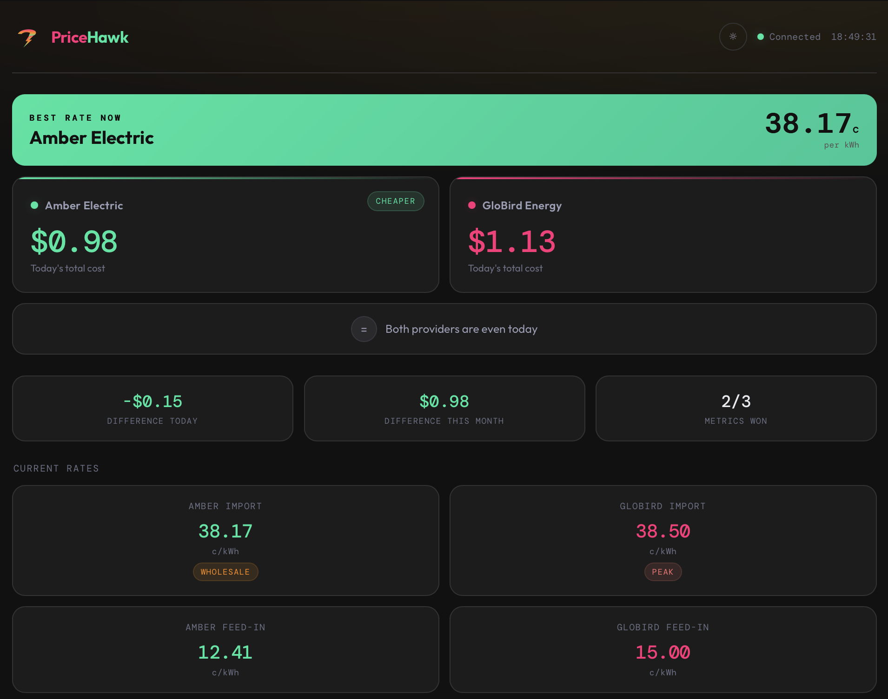
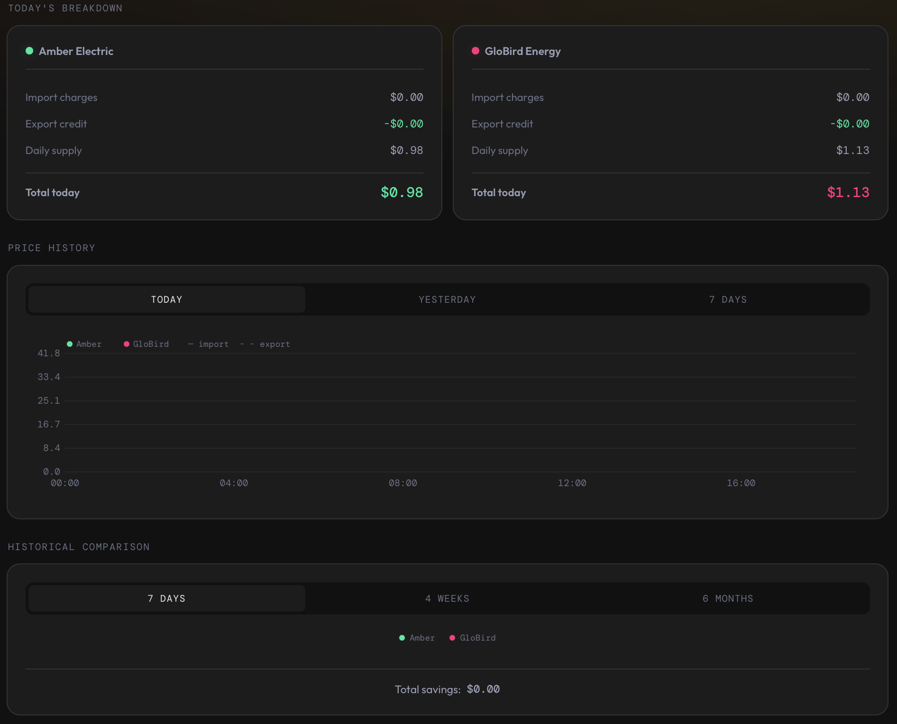
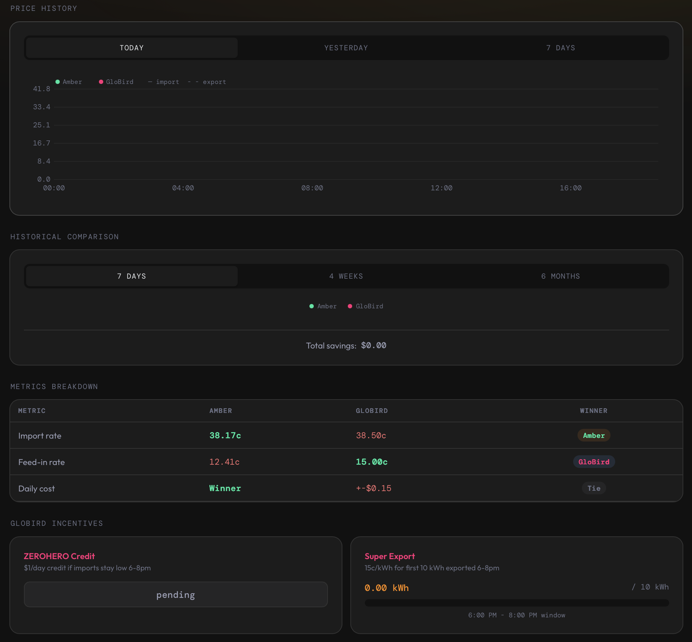

  

<h1 align="center">PriceHawk</h1>

  

Compare real energy costs between [Amber Electric](https://www.amber.com.au) and [GloBird Energy](https://www.globirdenergy.com.au) using your actual Home Assistant consumption data. Built for Australian households on any distributor network.

## Features

- **Real-time rate comparison** — live Amber wholesale prices vs GloBird TOU/flat tariffs
- **Total daily cost tracking** — includes energy charges, export credits, and daily supply fees
- **Amber bill fees** — network daily charge + subscription fee for accurate cost comparison
- **5 GloBird plans** — ZEROHERO, FOUR4FREE, BOOST, GLOSAVE, and Custom
- **Editable TOU time windows** — works with any distributor, not just one network
- **Demand charge support** — for networks that charge per kW of peak demand
- **Incentive tracking** — ZEROHERO credit, Super Export, Peak Solar Feed-in, prompt payment discount
- **Directional savings** — shows how much you'd save by switching, based on your current provider
- **Premium HTML dashboard** — auto-created in the sidebar with real-time WebSocket updates
- **Light/dark mode** — toggle with auto-detection, persists in localStorage
- **Price history chart** — Today/Yesterday/7 Days tabs with import + export rates
- **Responsive design** — desktop, tablet, and mobile optimised
- **Smart plan detection** — dashboard adapts to your GloBird plan (hides ZEROHERO for non-ZEROHERO plans)
- **Animated value transitions** — smooth number animations on rate changes

## Sensors

| Sensor | Entity ID | Description |
|---|---|---|
| Amber Import Rate | `sensor.amber_import_rate` | Current Amber wholesale import rate (c/kWh) |
| Amber Feed-in Tariff | `sensor.amber_feed_in_tariff` | Current Amber feed-in rate (c/kWh) |
| Amber Peak Rate | `sensor.amber_peak_rate` | Same as import rate (Amber is dynamic) |
| Amber Daily Charges | `sensor.pricehawk_amber_daily_charges` | Network + subscription fees (AUD/day) |
| Amber Cost Today | `sensor.pricehawk_amber_cost_today` | Total Amber cost today (AUD) |
| Amber Import Cost | `sensor.pricehawk_amber_import_cost` | Import charges today (AUD) |
| Amber Export Credit | `sensor.pricehawk_amber_export_credit` | Export earnings today (AUD) |
| GloBird Import Rate | `sensor.globird_import_rate` | Current GloBird import rate (c/kWh) |
| GloBird Feed-in Tariff | `sensor.globird_feed_in_tariff` | Current GloBird feed-in rate (c/kWh) |
| GloBird Peak Rate | `sensor.globird_peak_rate` | GloBird peak rate from config (c/kWh) |
| GloBird Cost Today | `sensor.pricehawk_globird_cost_today` | Total GloBird cost today (AUD) |
| GloBird Import Cost | `sensor.pricehawk_globird_import_cost` | Import charges today (AUD) |
| GloBird Export Credit | `sensor.pricehawk_globird_export_credit` | Export earnings today (AUD) |
| GloBird Daily Supply | `sensor.pricehawk_globird_daily_supply` | Daily supply charge (AUD/day) |
| Cheapest Today | `sensor.pricehawk_cheapest_today` | Provider with the lowest total daily cost |
| Best Provider | `sensor.pricehawk_best_provider` | Provider with the cheapest current import rate |
| Best Rate | `sensor.pricehawk_best_rate` | Cheapest current import rate (c/kWh) |
| Difference Today | `sensor.pricehawk_saving_today` | Cost difference between providers today (AUD) |
| Difference This Month | `sensor.pricehawk_saving_month` | Accumulated monthly difference (AUD) |
| Metrics Won | `sensor.pricehawk_metrics_won` | Rate metrics comparison (e.g. "2/3") |
| Last Updated | `sensor.pricehawk_last_updated` | Timestamp of last data refresh |
| ZeroHero Status | `sensor.pricehawk_zerohero_status` | ZEROHERO credit status (pending/earned/lost) |

## Installation

### HACS (Recommended)

Or manually:
1. Open HACS → Integrations → three-dot menu → **Custom repositories**
2. Add `https://github.com/Artic0din/ha-pricehawk` with category **Integration**
3. Search for "PriceHawk" and install
4. Restart Home Assistant

### Manual

Copy `custom_components/pricehawk` to your HA `custom_components/` folder and restart.

## Setup

1. **Settings > Devices & Services > Add Integration > PriceHawk**
2. Enter your **Amber Electric API key** (generate in the Amber app under Developers)
3. Select your **Amber site** (if you have multiple)
4. Enter **Amber bill fees** — network daily charge and subscription fee from your latest bill
5. Select your **GloBird plan** — ZEROHERO, FOUR4FREE, BOOST, GLOSAVE, or Custom
6. Configure **import rates and time windows** (pre-filled for known plans, fully editable)
7. Configure **export/feed-in rates and time windows**
8. Toggle **incentives** applicable to your plan
9. Select your **grid power sensor** (e.g. from Powerwall, Envoy, or smart meter)
10. Choose your **current provider** (Amber or GloBird) and optionally add a **dashboard access token**

## Dashboard

PriceHawk auto-creates an HTML dashboard in the sidebar. A **Long-Lived Access Token** is required during setup to authenticate the dashboard's WebSocket connection — you can create one in your HA profile under **Security > Long-Lived Access Tokens**. It features:

- **Cheapest Today** banner — provider with the lowest total daily cost
- **Best Rate Now** banner — provider with the cheapest current import rate
- **Today's cost** comparison cards
- **Current rates** with TOU period badges (Peak/Shoulder/Off-Peak/Wholesale)
- **Daily wins tracker** — who wins each day this month (persisted across restarts)
- **Today's breakdown** — import charges, export credits, daily supply, total
- **Price history chart** — import + export rates with Today/Yesterday/7 Days tabs
- **Historical comparison** — 7 days/4 weeks/6 months cost bars
- **Metrics breakdown** — side-by-side rate comparison with colour-coded winners
- **Light/dark mode** toggle

A native Lovelace YAML dashboard is also included as a fallback at `custom_components/pricehawk/dashboard.yaml`.

## Screenshots

  

  

  

## Requirements

- Home Assistant 2024.1.0+
- Amber Electric account with API key
- Grid power sensor entity in Home Assistant

## License

[MIT](LICENSE)

## Acknowledgments

- [PowerSync](https://github.com/bolagnaise/PowerSync) — Amber API patterns and HA integration architecture
- [Amber Electric](https://www.amber.com.au) — Public API for wholesale electricity pricing
- [GloBird Energy](https://www.globirdenergy.com.au) — Transparent tariff fact sheets
- [Home Assistant](https://www.home-assistant.io) — The platform that makes this possible
