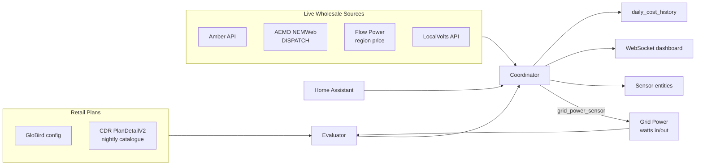

# Architecture

PriceHawk is a Home Assistant custom integration that compares your live electricity consumption against multiple retailer pricing models, ranks every CDR-listed plan against your usage, and surfaces the results via sensors and a packaged dashboard.

This document maps the codebase, traces the main data flows, and explains the coordinator pattern.

## Top-level layout

```
custom_components/pricehawk/
├── __init__.py            # HA platform setup, service registration
├── manifest.json          # HA integration metadata
├── const.py               # Config keys, polling intervals, provider IDs
├── config_flow.py         # Setup wizard + OptionsFlow
├── coordinator.py         # DataUpdateCoordinator (single source of truth)
├── sensor.py              # Sensor entity definitions
├── services.yaml          # Service descriptors (backfill_history, rank_alternatives, reset_today)
├── dashboard_config.py    # Dashboard registration + cache-busting
├── dashboard.yaml         # Lovelace dashboard YAML
├── strings.json           # i18n strings
├── translations/          # en.json translations
├── www/
│   └── dashboard.html     # Standalone WebSocket-driven dashboard
├── providers/             # Live-API retailer adapters
│   ├── base.py            # WholesalePriceSource protocol
│   ├── amber.py           # Amber Electric (REST)
│   ├── flow_power.py      # Flow Power (region-based wholesale + Happy Hour)
│   ├── localvolts.py      # LocalVolts (REST, customer-keyed)
│   └── cdr_plan.py        # Any CDR PlanDetailV2 plan
├── cdr/                   # Consumer Data Right (CDR) ingestion + ranking
│   ├── cdr_client.py      # AER GetGenericPlans / GetGenericPlanDetail
│   ├── models.py          # PlanDetailV2 dataclasses
│   ├── registry.py        # On-disk catalogue snapshot
│   ├── ranking.py         # cheap_rank heuristic
│   ├── ranking_job.py     # Nightly 00:30 ranking coordinator
│   ├── evaluator.py       # Tariff streaming evaluator
│   ├── streaming.py       # Window-aware cost accumulator
│   ├── history_replay.py  # HA recorder → grid-power replay
│   ├── rollup.py          # Per-window aggregation (today/week/month/3M/year)
│   └── incentive_parsers/ # ZEROHERO, FOUR4FREE, Super Export, VPP rebate, …
├── aemo_api.py            # AEMO NEMWeb DISPATCH region price fetch
├── amber_calculator.py    # Amber net-daily-cost math
├── tariff_engine.py       # GloBird stepped + TOU + incentive evaluator
├── backfill.py            # HA recorder history → daily_cost_history
├── helpers.py             # Shared utilities (timezone, slug, etc.)
├── explanation.py         # "Why X won today" reason builder
└── csv_analyzer.py        # Amber CSV import path (dashboard wizard)
```

## Component model



## Data flow

### Live polling

Every `COORDINATOR_SCAN_INTERVAL` seconds the coordinator:

1. Reads the grid-power sensor (`sensor.power_sync_grid_power` or similar) — positive watts = import, negative = export.
2. Fetches the live wholesale price (Amber if configured, otherwise AEMO).
3. Multiplies kWh consumed since last tick by each plan's current rate.
4. Adds daily supply, applies incentives (free-power windows, ZEROHERO credit, Happy Hour FiT, etc.).
5. Persists running totals to `daily_cost_history` (the single source of truth).
6. Publishes `coordinator.data` to all sensor entities and the dashboard.

### Nightly ranking (00:30 AEST)

`cdr/ranking_job.py` schedules a daily job that:

1. Refreshes the CDR catalogue snapshot via `cdr/cdr_client.py` (paginated `GetGenericPlans` per retailer base URI).
2. Runs cheap-rank: `score = peak_rate * 0.7 + daily_supply * 0.3` on every fuel-electricity plan.
3. Keeps the top-K (default 20) and runs deep-rank: streams the last N days of grid-power through `cdr/streaming.py` for each candidate.
4. Stores results on the coordinator and surfaces them via `sensor.pricehawk_ranked_alternatives`.

### Backfill replay

`backfill.py` reads HA recorder history via `state_changes_during_period`, replays it through the streaming evaluator, and populates `daily_cost_history` with retroactive per-day costs.
Bounded by recorder retention (typically 10 days unless `purge_keep_days` is raised).

## Coordinator pattern

The coordinator (`coordinator.py`) is the **single source of truth**.
All sensor entities and the dashboard read from `coordinator.data` — never from each other, never from disk directly.

Key state:

- `_amber: AmberPriceSource | None` — live Amber adapter (only when user is on Amber)
- `_wholesale_source` — fallback to AEMO when Amber isn't configured
- `_daily_cost_history: dict[date, DailyCostRow]` — every comparator's net daily cost
- `_saving_month_aud` — running monthly savings delta vs winner
- `_rank_results: list[RankedAlternative]` — output of last nightly rank
- `_first_ranking_event: asyncio.Event` — gated on first rank to avoid empty dashboards
- `_store: PriceHawkStore` — persists across HA restarts (subclasses HA's `Store`, supplies the migration callback required by Constitution P16)

## State persistence

- `core.config_entries` — user-editable config (provider, API key, grid sensor, options)
- `PriceHawkStore(STORAGE_VERSION, STORAGE_MINOR_VERSION)` — daily_cost_history, saving totals, rank results, last-tick timestamp
- HA recorder — raw grid-power history (read-only, used for backfill)

Storage version checks gate `from_dict()` loads; an explicit HA-timezone `date` is required (no `date.today()` fallback) to prevent UTC drift.

## Storage migration policy

Constitution P16 (Data Integrity) requires that every persisted-state change consider migrations, default values, nullability, and rollback safety.
PriceHawk persists state across two surfaces, each with its own version axis:

| Surface | Version constant | Migrator hook | Where it lives |
|---|---|---|---|
| HA `Store` payload (`pricehawk_state` in `.storage`) | `STORAGE_VERSION` (major) + `STORAGE_MINOR_VERSION` (minor) | `PriceHawkStore._async_migrate_func` | `storage.py` |
| HA config entry (`entry.data` + `entry.options`) | `CONFIG_ENTRY_VERSION` (mirrors `ConfigFlow.VERSION`) | `async_migrate_entry` | `__init__.py` |

### Bump procedure (Store payload)

1. Decide major vs minor:
   * **Major** — renamed key, removed key, restructured payload, semantic change. Bumps `STORAGE_VERSION`.
   * **Minor** — purely additive (new optional field with a safe default). Bumps `STORAGE_MINOR_VERSION`.
2. Register the migrator BEFORE bumping the constant:
   * Major bump → add an entry to `storage._MAJOR_MIGRATORS[OLD_VERSION]`.
   * Minor bump → add an entry to `storage._MINOR_MIGRATORS[OLD_MINOR]`.
   * For additive-only changes where the consumer fills defaults via `.get(key, default)` at read-time, register an inline identity migrator (`async def(old): return dict(old)`) — both registries fail loudly on missing entries to prevent shipping a bump without the paired migrator.
3. Bump the constant in `const.py`.
4. Add a regression test in `tests/test_runtime_data.py` that asserts the old payload migrates to the new shape with no data loss.
5. CHANGELOG entry under the appropriate section.

### Bump procedure (Config entry)

1. Add an entry to `__init__._CONFIG_ENTRY_MIGRATORS[OLD_VERSION]`.
2. Bump `CONFIG_ENTRY_VERSION` in `const.py` AND the `VERSION` class attribute on `ConfigFlow` in `config_flow.py` — they must stay synchronised.
3. Regression test that loads an older-version entry through `async_migrate_entry`.

### Non-negotiable rules

* **Never discard data on a major mismatch.**
  The Store migrator MUST rewrite the payload; raising `ValueError` for unrecoverable drift is acceptable, silent zeroing is not.
* **Never downgrade.**
  Both migrator paths refuse when the persisted version is newer than the in-code version — the user can roll the integration forward or wipe the storage key explicitly.
* **Stamp `_storage_version` on every save.**
  The in-payload sentinel is the second defensive layer behind the Store envelope and is checked by `coordinator.async_restore_state`.
* **No HA-version-conditional logic in migrators.**
  Migrators only see the shape of the data, not the HA version.

## Threading model

All I/O is `async`/`await` via `aiohttp`.
Tariff math is synchronous CPU work — kept simple enough that no offloading is needed.
The nightly ranking job runs via `async_track_time_change` so it survives HA restarts.

## Where to start reading

- New to the codebase? `coordinator.py:_async_update_data` is the live-polling loop.
- Adding a new provider? `providers/base.py` defines the protocol; `providers/amber.py` is the cleanest reference implementation.
- Adding a CDR incentive? `cdr/incentive_parsers/` — each parser is one file, each tested independently.
- Changing dashboard layout? `www/dashboard.html` is a single self-contained file; bumping `dashboard_config.py`'s version constant busts the browser cache.
